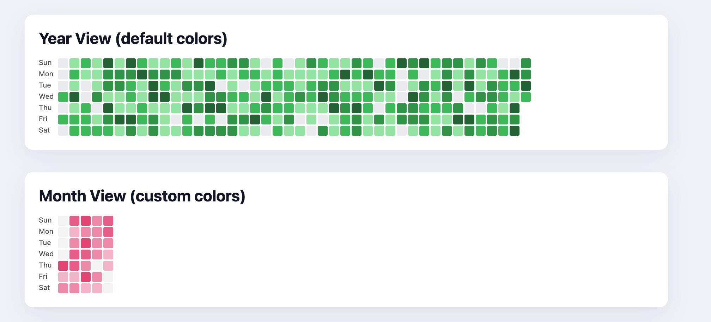

Calendar Heatmap
================

English | [简体中文](./README.zh-CN.md) 



Calendar Heatmap is a lightweight JavaScript library for rendering calendar heatmaps. It works in any modern browser, supports multiple time windows, and ships as a single dependency-free bundle.

## Features
- Render yearly, monthly, weekly, or rolling recent-day grids
- Configure square size, gaps, and color scales (arrays or custom functions)
- Localize weekday labels, tooltips, and legend captions via built-in language packs
- Trim large grids automatically to fit narrower containers
- Works with raw arrays of `{ date, value }` style data objects

## Installation
```bash
npm install calendar-heatmap
# or
yarn add calendar-heatmap
```

You can also load the bundled `index.js` or minified `index.min.js` directly via a `<script>` tag.

```html
<!-- Use the minified version for production -->
<script src="path/to/calendar-heatmap/index.min.js"></script>

<!-- Or use the unminified version for development -->
<script src="path/to/calendar-heatmap/index.js"></script>
```

## Quick Start
```html
<div id="heatmap"></div>
<script type="module">
	import CalendarHeatmap from 'calendar-heatmap';

	const data = [
		{ date: '2025-01-01', value: 5 },
		{ date: '2025-01-02', value: 3 },
		{ date: '2025-01-04', value: 9 }
	];

	const heatmap = new CalendarHeatmap('#heatmap', data, {
		view: 'year',
		language: 'en',
		legend: true
	});

	// Update later
	heatmap.setOptions({ view: 'recent', recentDays: 30 });
</script>
```

## API

### Constructor
```ts
new CalendarHeatmap(container, data?, options?)
```
- `container`: CSS selector or DOM node to mount into
- `data`: array of `{ date | day | dateString, value | count }`
- `options`: see below

### Options
| Option | Type | Default | Description |
| --- | --- | --- | --- |
| `view` | `'year' \| 'month' \| 'week' \| 'recent'` | `'year'` | Layout preset |
| `year` | `number` | current year | Target year for `year`/`month` views |
| `month` | `number` | current month | Zero-based month index |
| `weekStart` | `0 \| 1` | `0` | First weekday (`0` Sunday, `1` Monday) |
| `recentDays` | `number` | `7` | Number of trailing days for `recent` view |
| `startDate` | `Date \| string` | today | Anchor date for `week` view |
| `squareSize` | `number` | `14` | Pixel size of each day cell |
| `squareGap` | `number` | `2` | Gap between cells |
| `colorScale` | `string[] \| (value, max) => string | { color, level }` | GitHub green palette | Mapping from values to colors |
| `maxValue` | `number \| null` | max of data | Upper bound for scale calculations |
| `legend` | `boolean` | `false` | Render color legend |
| `tooltip` | `boolean` | `true` | Enable hover tooltip |
| `locale` | `string \| string[]` | browser default | ICU locale for date formatting |
| `language` | `string` | `'en'` | Language pack key (see below) |

### Methods
- `setOptions(options)` – merge new options and rerender
- `setData(data)` – replace data and rerender
- `replaceData(data)` – alias of `setData`
- `updateData(data)` – update existing entries (if implemented)
- `setValue(date, value)` – helper to change a single day
- `render()` – force rerender
- `destroy()` – remove DOM nodes and tooltips

### Language Packs
Calendar Heatmap ships with these language keys:

| Key | Locale | Description |
| --- | --- | --- |
| `en` | `en-US` | English |
| `zh-cn` | `zh-CN` | Simplified Chinese |
| `zh-tw` | `zh-TW` | Traditional Chinese |
| `ja` | `ja-JP` | Japanese |
| `fr` | `fr-FR` | French |
| `de` | `de-DE` | German |
| `ko` | `ko-KR` | Korean |
| `es` | `es-ES` | Spanish |
| `it` | `it-IT` | Italian |

Use aliases such as `zh`, `zh-Hans`, `en-GB`, etc. to select the closest match automatically. The active pack controls weekday labels, tooltip text, and legend captions.

Custom packs can be registered by mutating `CalendarHeatmap.languages`:

```js
CalendarHeatmap.languages['pt-br'] = {
	locale: 'pt-BR',
	legend: { less: 'Menos', more: 'Mais' },
	weekdays: ['Dom', 'Seg', 'Ter', 'Qua', 'Qui', 'Sex', 'Sáb'],
	tooltip: (value, dateLabel) => `${value} em ${dateLabel}`
};
```

## Development
- Clone the repo and install dependencies with `npm install`
- Run `npm run build` (if available) or open `tests/index.html` in a browser for manual testing
- Linting/tests are minimal; contributions welcome

## License
MIT License.
