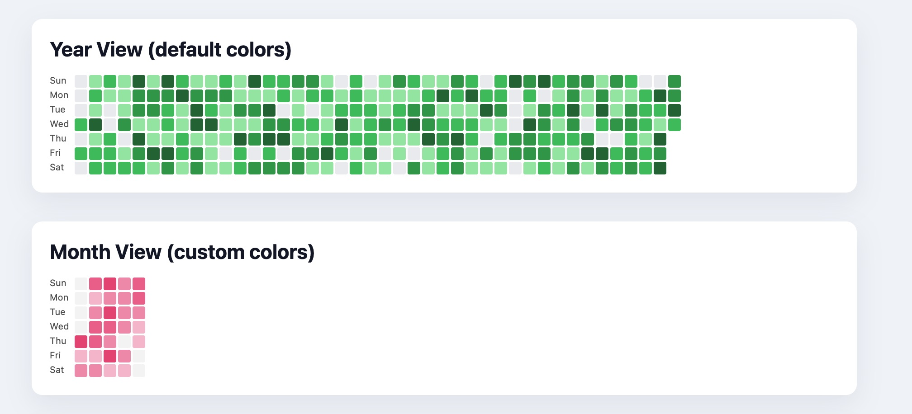

Calendar Heatmap
================

[English](https://github.com/hunter-ji/calendar-heatmap#calendar-heatmap)  | 简体中文



Calendar Heatmap 是一个轻量的 JavaScript 日历热力图库，支持多种时间窗口且无需额外依赖。

## 功能亮点
- 支持按年、按月、按周以及最近若干天的显示模式
- 可配置方格尺寸、间距，以及数组或函数形式的颜色映射
- 通过内置语言包本地化星期标签、提示气泡与图例文案
- 自动裁剪列宽以适配较窄的容器
- 接受 `{ date, value }` 结构的原始数据数组

## 安装
```bash
npm install calendar-heatmap
# 或者
yarn add calendar-heatmap
```

也可以直接通过 `<script>` 标签引入打包好的 `index.js` 或压缩后的 `index.min.js` 文件。

```html
<!-- 生产环境使用压缩版本 -->
<script src="path/to/calendar-heatmap/index.min.js"></script>

<!-- 或者开发环境使用未压缩版本 -->
<script src="path/to/calendar-heatmap/index.js"></script>
```

## 快速上手
```html
<div id="heatmap"></div>
<script type="module">
	import CalendarHeatmap from 'calendar-heatmap';

	const data = [
		{ date: '2025-01-01', value: 5 },
		{ date: '2025-01-02', value: 3 },
		{ date: '2025-01-04', value: 9 }
	];

	const heatmap = new CalendarHeatmap('#heatmap', data, {
		view: 'year',
		language: 'zh-CN',
		legend: true
	});

	heatmap.setOptions({ view: 'recent', recentDays: 30 });
</script>
```

## 主要配置
| 选项 | 类型 | 默认值 | 说明 |
| --- | --- | --- | --- |
| `view` | `'year' \| 'month' \| 'week' \| 'recent'` | `'year'` | 布局模式 |
| `year` | `number` | 当前年份 | 用于年/月视图 |
| `month` | `number` | 当前月份 | 0 起始的月份索引 |
| `weekStart` | `0 \| 1` | `0` | 每周起始日（0 周日，1 周一）|
| `recentDays` | `number` | `7` | 最近视图包含的天数 |
| `startDate` | `Date \| string` | 今天 | 周视图起始基准 |
| `squareSize` | `number` | `14` | 单元格尺寸 |
| `squareGap` | `number` | `2` | 单元格间距 |
| `colorScale` | `string[] \| (value, max) => string | { color, level }` | GitHub 绿色色阶 | 控制颜色映射 |
| `maxValue` | `number \| null` | 数据中最大值 | 颜色分级上限 |
| `legend` | `boolean` | `false` | 是否显示色阶图例 |
| `tooltip` | `boolean` | `true` | 是否启用悬浮提示 |
| `locale` | `string \| string[]` | 浏览器默认 | 控制日期格式 |
| `language` | `string` | `'en'` | 语言包键值 |

## 语言包
内置语言键包括：`en`、`zh-cn`、`zh-tw`、`ja`、`fr`、`de`、`ko`、`es`、`it`。可以使用 `zh`、`zh-Hans`、`en-GB` 等别名自动匹配，也支持追加自定义语言包：

```js
CalendarHeatmap.languages['pt-br'] = {
	locale: 'pt-BR',
	legend: { less: 'Menos', more: 'Mais' },
	weekdays: ['Dom', 'Seg', 'Ter', 'Qua', 'Qui', 'Sex', 'Sáb'],
	tooltip: (value, dateLabel) => `${value} em ${dateLabel}`
};
```

## 开发
- 克隆仓库后执行 `npm install`
- 运行 `npm run build`（如已提供）或直接打开 `tests/index.html` 进行手动测试
- 目前校验与测试较少，欢迎补充

## 许可证
MIT License。